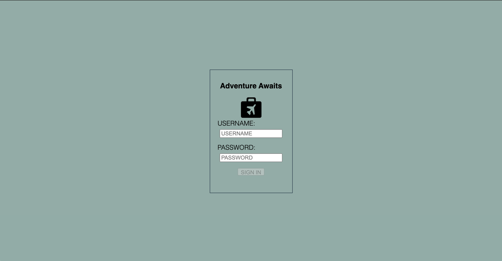

# Travel-Tracker

A user logs into their account and is shown a dashboard with all of their current, upcoming, pending and past trips taken. The user can then make a request for a new trip and see how much it will cost in total.

## Usage

On load a login screen is displayed (see picture below). The user has two input fields, one for their username and one for their password. For simplicity the user name is `traveler` + their `id` number and the password for all users is `travel2020`. The submit button will only enable once the username length is long enough to possible be correct. If the user enters the wrong value for either, an error message is display and tells them to try again. 

If it is correct, the dashboard will change to their profile page (see gif below). The user is greeted by their first name in the top left and the total amount they spent on traveling through the app in the year 2020 below the welcome message. If a user is suppose to be on a trip the "Current Trip" section will display the trip's information. Otherwise the user can see any upcoming, pending, or past trips in the same fashion in their respected sections.

If a user wants to plan a new trip, they can input the date, number of travelers, duration of trip, and select from the list of possible destinations that they want to go to. Once all inputs are filled out, the "Calculate Trip Cost" button is enabled. Clicking this displays a message of how much it will cost in total, depending on the duration, number of travelers, cost of flights per person and cost of lodging per night. This total states that it includes a 10% agent fee. If the user likes the price, they now have the option to "Submit Request". This request is sent to the API and if successfull will instantly be populated into the upcoming and pending sections. An example below:

## How to Install
1. `git clone` it down to your command line
2. Navigate into the repository on your machine
3. Run `npm i`
4. Run `npm start`

In a seperate tab in your terminal:
1. `git clone` [this server](https://github.com/turingschool-examples/travel-tracker-api)
2. Navigate into the repository on your machine
3. Run `npm i`
4. Run `npm start`

Now you can navigate to http://localhost:8080/ and it should be live

OR

visit the deployed site [here](https://lbmerchant93.github.io/Travel-Tracker/)

## Planning
I utilized Github Projects and miro for project management, that board can be found [here](https://github.com/lbmerchant93/Travel-Tracker/projects/1)
The detailed spec for this project can be found [here](https://frontend.turing.io/projects/travel-tracker.html).

### Testing development
For this project, I broke the data into three different classes so far with the possibility for more with the improvement of the app. Tests were run for each property, method and anything updating a class property. I have not made it far enough to utilize the destination instantiations yet, but could be useful in further iterations. I did only happy path testing because I am unsure on how I could sad path test for this funcitonality so far. Given more time I believe I could have moved more things into classes and utilized more methods (something I could do going forward).

## Challenges
- Figuring out how to apply sad path testing to the classes.
- Creating a bunch of new trips when figuring out how to work the POST request and having to come up with a way to remove them all (not a feature implemented yet but there is a function writen out to be called when needed while developing).
- Displaying the information in a visually pleasing way in the allotted time

## Wins
- Using GET, POST and DELETE API request correctly
- Implementing SASS, Mixins, and Media Queries for an organized and responsive site

## Technologies Used
1. JavaScript (vanilla)
2. HTML
3. Sass/SCSS
4. WebPack
5. Chai & Mocha
6. Github

## Future Iterations
- Be able to view the trip card in more detail, I'd like to make the cards a bit bigger so that the picture is more visible. I'd like to add an area that shows the suggested activities for that trip.
- If you are currently on a trip, I'd like to use the open space that is there to include an itinerary for that trip.
- The functionality for seeing how much a user spent in a year is there, I'd like to give them the option of which year to see their spendings.
- A logout functionality would be nice, to go back to the login screen and require a user to login again.
- Color Scheme or aesthetic of the site could use an upgrade.
- A way to remove a trip if desired

## Project Members
This project was designed and implemented by [Lucas Merchant](https://github.com/lbmerchant93)

